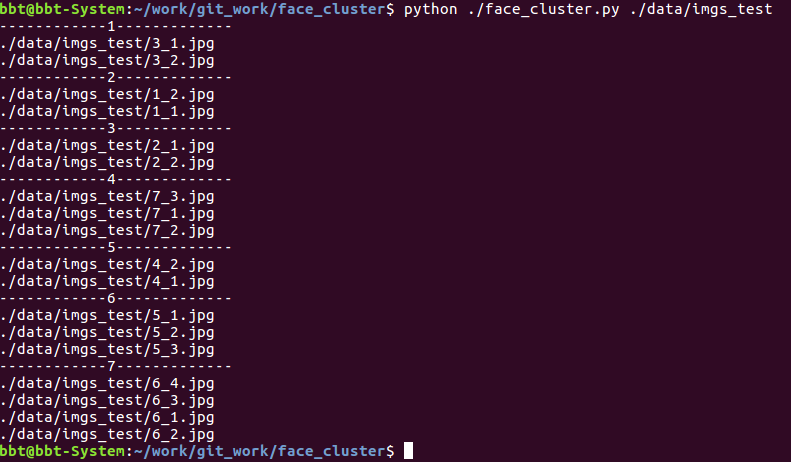

# face_cluster
人脸聚类项目
# model
* lcnn人脸特征提取模型：链接: https://pan.baidu.com/s/1eSyrexYWnyhCcEscY23Fcg
* 将下载好的模型放到项目主目录下的./face_feature/models
# run
* 准备一个文件夹，并将剪切好的，需要聚类的人脸照片放进去，记录路径为imgs_dir
* 进入项目主目录
* 运行 python ./face_cluster.py imgs_dir
* 运行示例：

